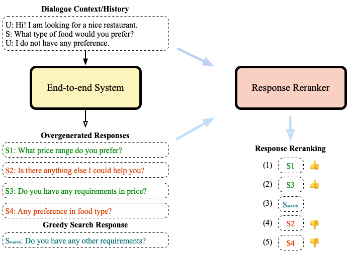
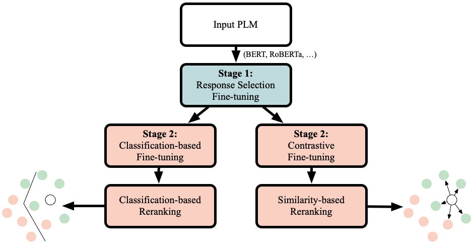

# Response-Reranking


Code repository for the paper: <br>

[***Reranking Overgenerated Responses for End-to-End Task-Oriented Dialogue Systems***](https://arxiv.org/abs/2211.03648)
by [Songbo Hu](https://github.com/songbohu), [Ivan Vulić](https://sites.google.com/site/ivanvulic/), [Fangyu Liu](http://fangyuliu.me/about.html), and [Anna Korhonen](https://sites.google.com/site/annakorhonen/).


This response reranker is a simple yet effective model which aims to select high-quality items from the lists of responses initially over-generated by any end-to-end task-oriented dialogue system.


<p float="middle">
  
   
</p>

## Environment

The code is tested with python 3.8. Firstly, install Pytorch 1.11.0 from the [official website](https://pytorch.org). Then, clone this repository and install the dependencies:

```bash
>> git clone git@github.com:cambridgeltl/response_reranking.git
>> pip install -r requirements.txt
```

## Data Preprocessing

Before training and evaluating our reranking models, unzip data.zip in the repository root directory. It contains three files and a folder: 0.7_train.json, 0.7_dev.json, 0.7_test.json, and multi-woz-processed.

```bash
>> unzip data.zip
```

Each JSON file contains overgenerated responses from the [MinTL System](https://github.com/zlinao/MinTL). It is a list of candidate response pairs with the following fields:

<ul>
  <li>"context_text" denotes the lexicalised dialogue context.</li>
  <li>"resp_text" and "resp_nodelex" are the ground truth delexicalised/lexicalised responses to the given dialogue context. </li>
  <li>"resp_gen" is the generated delexicalised response based on greedy search given the dialogue context.</li>
  <li>"over_gen" is a list of 20 overgenerated delexicalised responses based on top-p sampling given the given dialogue context.</li>
</ul>

We used the preprocess script (setup.sh) from [**DAMD**](https://gitlab.com/ucdavisnlp/damd-multiwoz) to perform delexicalisation and produce files in multi-woz-processed.

## Generating Similarity Scores

Generating the cosine similarity scores with the [all-mpnet-v2 encoder](https://huggingface.co/sentence-transformers/all-mpnet-base-v2) between the overgenerated responses and the ground truth responses:

```bash
>> PYTHONPATH=$(pwd) python ./src/generate_similarity_scores.py
```

Generating the cosine similarity scores with the [all-mpnet-v2 encoder](https://huggingface.co/sentence-transformers/all-mpnet-base-v2) between the greedy search responses and the ground truth responses:

```bash
>> PYTHONPATH=$(pwd) python ./src/generate_similarity_scores_greedy.py
```

## Training


For stage 1: response selection training:

```bash
>> PYTHONPATH=$(pwd) python ./src/train_response_selection_cross_encoder.py
```

For stage 2: similarity-based response reranking training:

```bash
>> PYTHONPATH=$(pwd) python ./src/train_similarity_reranking.py
```

For stage 2: classification-based response reranking training:

```bash
>> PYTHONPATH=$(pwd) python ./src/train_classification_reranking.py
```


## Testing

For testing the similarity-based response reranking models:

```bash
>> PYTHONPATH=$(pwd) python ./src/eval_similarity_reranking.py
```

For testing the classification-based response reranking models:

```bash
>> PYTHONPATH=$(pwd) python ./src/eval_classification_reranking.py
```
